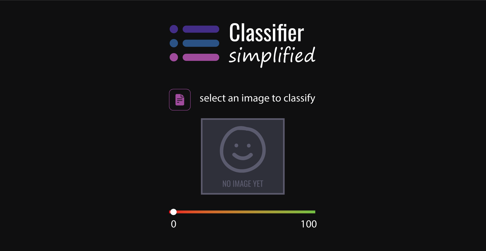

# Image Classifier with GUI

This repository contains a Python application that uses a pre-trained deep learning model to classify images. The application provides a user-friendly graphical user interface (GUI) where users can select an image from their file system and receive a prediction about the content of the image.



## Features

- **Graphical User Interface (GUI):** The application includes a GUI built using `taipy` library, making it easy for users to interact with the image classification model.
- **Pre-trained Model:** The application utilizes a pre-trained deep learning model trained on the CIFAR-10 dataset, capable of classifying images into one of ten classes: airplane, automobile, bird, cat, deer, dog, frog, horse, ship, or truck.
- **Real-time Prediction:** Users can select an image from their local file system, and the application provides a real-time prediction of the content of the image.

## Requirements

To run this application, you need to have the following dependencies installed:

- Python 3.x
- `taipy` library
- `tensorflow` library
- `PIL` library
- `numpy` library

You can install the required Python libraries using pip:

```bash
pip install taipy tensorflow pillow numpy
```

## Usage

1. Clone the Repository:

```bash
git clone https://github.com/nanaagyei/ml-gui-app.git
```

2. Navigate to the Repository:

```bash
cd ml-gui-app
```

3. Install the requirements:

```bash
pip install -r requirement.txt
```

4. Run the Application:

```bash
python classifier.py
```

5. Interact with the GUI: One the application is running, your web browser automatically opens at `http://localhost:8000`. Follow the instructions to select an image from your file system to view the prediction.

## Acknowledgements

- This application is based on the work by Prince Agyei Tuffour and is provided for educational purposes.
- The pre-trained deep learning model used in this application is adapted from [MariyaSha](https://github.com/MariyaSha/ml_gui_app)

Feel free to modify and enhance this application according to your needs. If you encounter any issues or have suggestions for improvements, please feel free to open an issue or submit a pull request. Thank you for using our image classification application! 🚀
